# 
 Install GIT
<ul>
  <li>Open Eclipse</li>
  <li>Choose project => right click “Team”=> Share project</li>
  <li>Press button "Create…”</li>
  <li>Choose folder for local repository =>double press “Finish”</li>
  <li>Press “Window”=> “Perspective”=> “Customize perspective”</li>
  <li>Move to bookmark Action Set Aviailiability” => Click to “Git” and “Navigation Git”</li>
  <li>Check what happened. Add Git to a work space:</li>
  
  1. Open Window => show view => other…
  2. Click on “Git repository”, "Git Staging” and Version Control (Team) => History
  
  <li>Go to menu “Git” => Commit</li>
  OR
  <li>Choose project => right click =>Team => Commit</li>
  <li>Choose needed files and move to “Staged Changes”</li>
  <li>In field for description add some text:</li>
  
  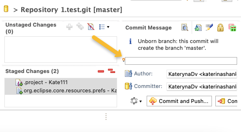
  
  and press “Commit“
  
  <li>On the left side you can see status of repository:</li>
  
  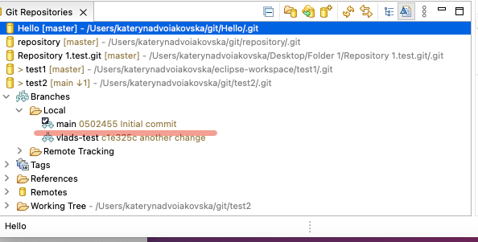
  <li>On the left side click (right button)“Remotes” and “Create Remote”</li>
  
  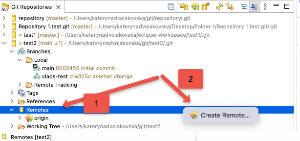
  <li>Add remote name and push Create:</li>
  
  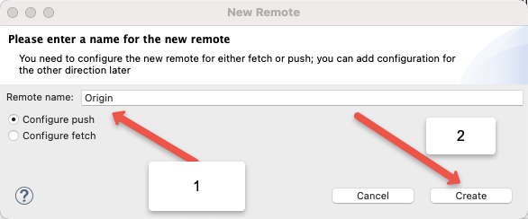
  <li>Displayed new window, click “Change”</li>
  
  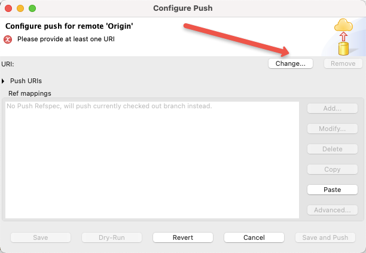
  
  *Copy your GitHub repository address 
  
  <li>Displayed window with address repository, add user name and password => click Finish</li>
  
   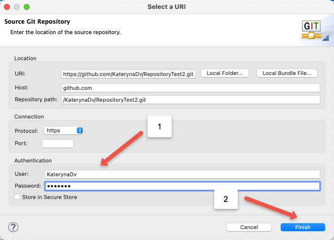
  <li>In a previous window click Advanced</li>
  
  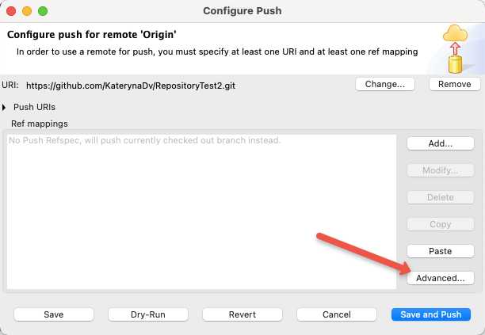
  <li>Select “Source led”: Main/branch</li>
  
  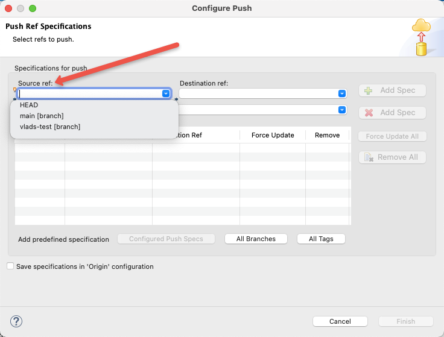
  <li>Click “Add spec” => pic “Save specifications in “Origin” configuration => Finish</li>
  
  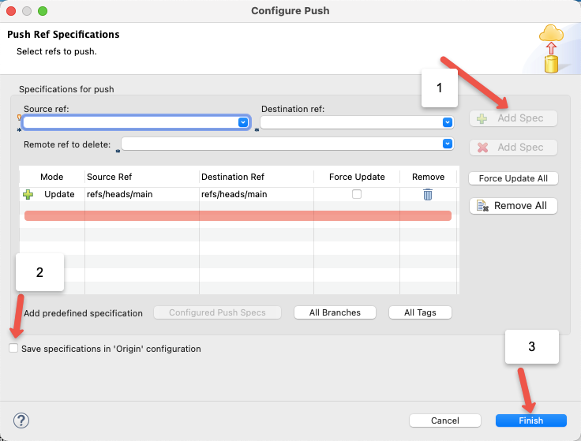
  <li>Click “Save”</li>
  
  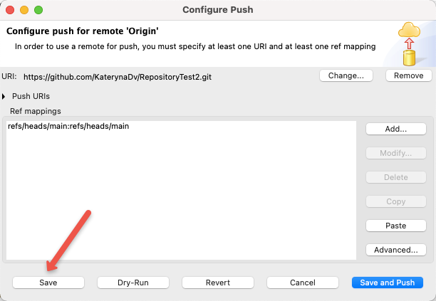
  <li>Select 2th Git catalogue (step 1) and push button “Push current branch”(step 2):</li>
  
   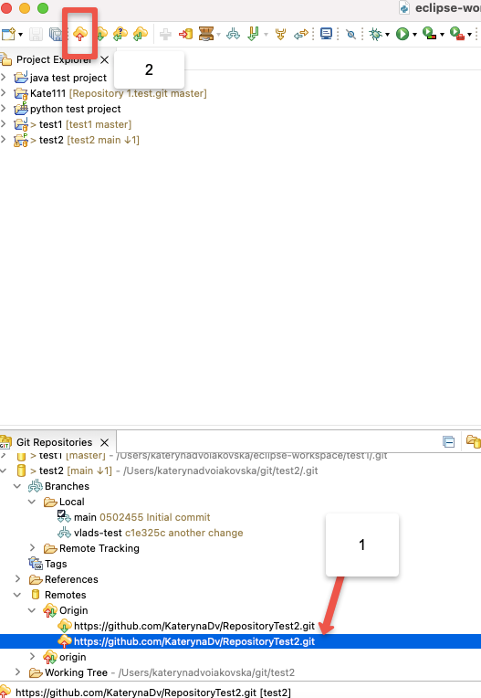
  
  <li></li>
  </ul>